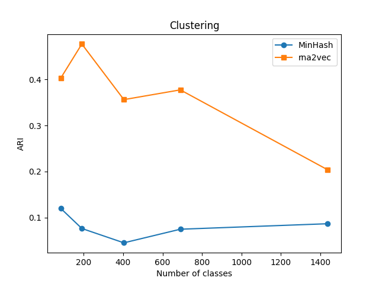
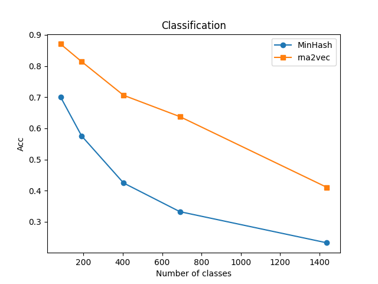

# ml-sketching

This is the course project for 02710. The project is about machine learning based sketching algorithms for rna sequence.

## Installation

```bash
git clone https://github.com/baolef/ml-sketching.git
cd ml-sketching
conda env create -f environment.yml
conda activate sketching
```

## Data

The data we use from SILVA database. You can download the data from [here](https://www.arb-silva.de/fileadmin/silva_databases/release_138.1/Exports/SILVA_138.1_SSURef_NR99_tax_silva.fasta.gz) and put it in the `inputs/rna/` folder.

In Linux, you can run the following commands to prepare the data:

```bash
mkdir -p inputs
cd inputs/rna
wget https://www.arb-silva.de/fileadmin/silva_databases/release_138.1/Exports/SILVA_138.1_SSURef_NR99_tax_silva.fasta.gz
gzip -d SILVA_138.1_SSURef_NR99_tax_silva.fasta.gz
```

## Usage

To train the machine learning based sketching model (rna2vec), you can run the following command to save the model with `.w2v` extension in the `save/` folder:

```bash
python scripts/train_dna2vec.py -c configs/rna.yml
```

To sketch the rna sequence using the rna2vec model, you can run the following command to save the sketching in the `inputs/` folder:

```bash
python scripts/sketch_rna2vec.py -m MODEL_PATH.w2v -i inputs/SILVA_138.1_SSURef_NR99_tax_silva.fasta -o inputs
```

To sketch the rna sequence using the MinHash algorithm, you can run the following command to save the sketching in the `inputs/` folder:

```bash
python scripts/sketch_minhash.py -i inputs/SILVA_138.1_SSURef_NR99_tax_silva.fasta -o inputs
```

To train the clustering model, you can run the following command:

```bash
python scripts/clustering.py -i inputs/SILVA_138_3_8_sliding_0_rna2vec.npz -c 1 -d euclidean
python scripts/clustering.py -i inputs/SILVA_138_3_8_sliding_0_minhash.npz -c 1 -d hamming
```

Notice that `-c` is an integer to specify the level of classes in the inheritance tree and `-d` is a string to specify the distance metric, where we recommend to use `euclidean` for rna2vec and `hamming` for MinHash.

To train the classification model, you can run the following command:

```bash
python scripts/classification.py -i inputs/SILVA_138_3_8_sliding_0_rna2vec.npz -c 1
```

## Results

<p float="left">
  
  
</p>

rna2vec outperforms MinHash in clustering and classification tasks.
